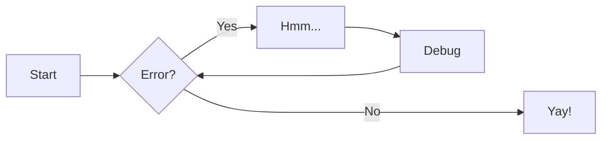

--- 
title: Test Lab 
---

# 测试文件

## 标题

### 标题

#### 标题

##### 标题

###### 标题

## Admonitions

!!! note
  
    提醒

??? note

    可以展开的提醒

???+ note

    默认展开的提醒

!!! abstract

    摘要

!!! info

    信息

!!! tip

    提示 

!!! success

    成功 

!!! question

    问题

!!! warning

    警告 

!!! failure

    失败 

!!! danger

    危险！

!!! bug

    bug 

!!! example

    示例 

!!! quote

    引用

!!! example "举个例子"

    这是被举的例子

## 注解

!!! example "举个带注解的例子"
  
    这是带注解(1)的例子
    {.annotate}
    
    1. 我是注解！

```python
print("Hello, world!") # (1)!
```

1. 这样来给代码注解

```python title="test.py"
def test():
  return 0;
```

```cpp title="main.cc" linenums="35"
std::optional<Data> getData();
```

```rust
#[cfg(test)]
mod tests {
    use pliron::context::Context;
    #[allow(unused)]
    #[test]
    fn pliron_links() {
        let ctx = Context::new();
    }
}
```

## 使用标签页

=== "Python"

    ```python
    print("Hello, world.")
    ```

=== "C++"

    ```cpp
    #include <iostream>

    int main() {
      std::cout << "Hello, world." << std::endl;
      return 0;
    }
    ```

## 使用表格（和 emoji）

| Method      | Description                          |
| ----------- | ------------------------------------ |
| `GET`       | :material-check:     Fetch resource  |
| `PUT`       | :material-check-all: Update resource |
| `DELETE`    | :material-close:     Delete resource |

:smile:

## 使用 mermaid



## 使用脚注

上海交通大学在当地[^1]的综合排名位居第一。

[^1]: 指上海市闵行区

## 使用删除线

~~这项内容~~ 应当被删除。

## TODO List

- [x] 打一小会儿游戏
- [ ] 复习今天的课程

## LaTeX

使用 KaTeX 渲染，可能需要注意语法。

$$
主=6
$$

## 图片

<figure markdown="span">
  { width="300" }
  <figcaption>身份认同</figcaption>
</figure>
