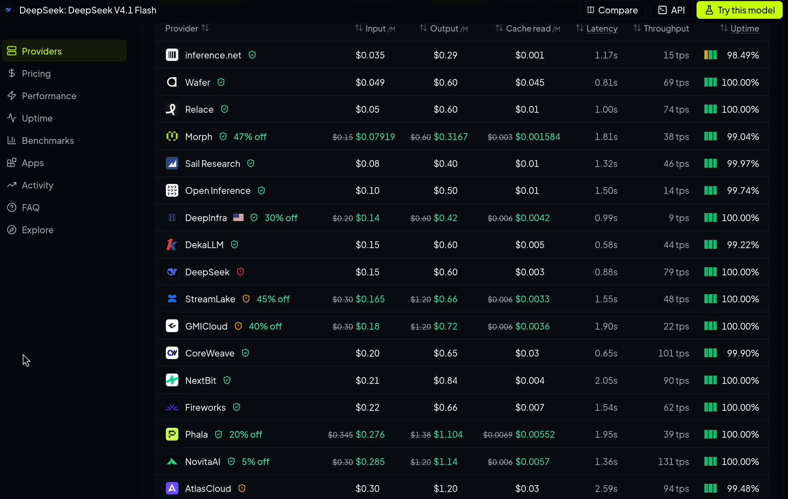
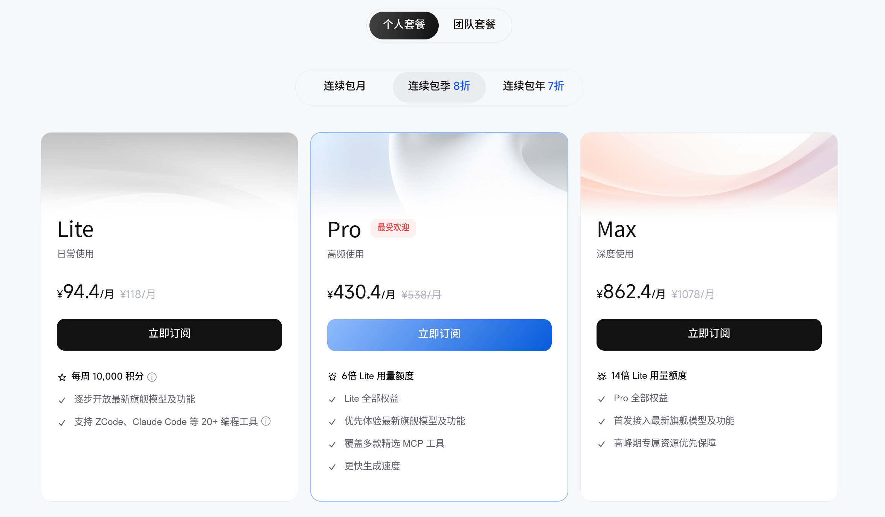
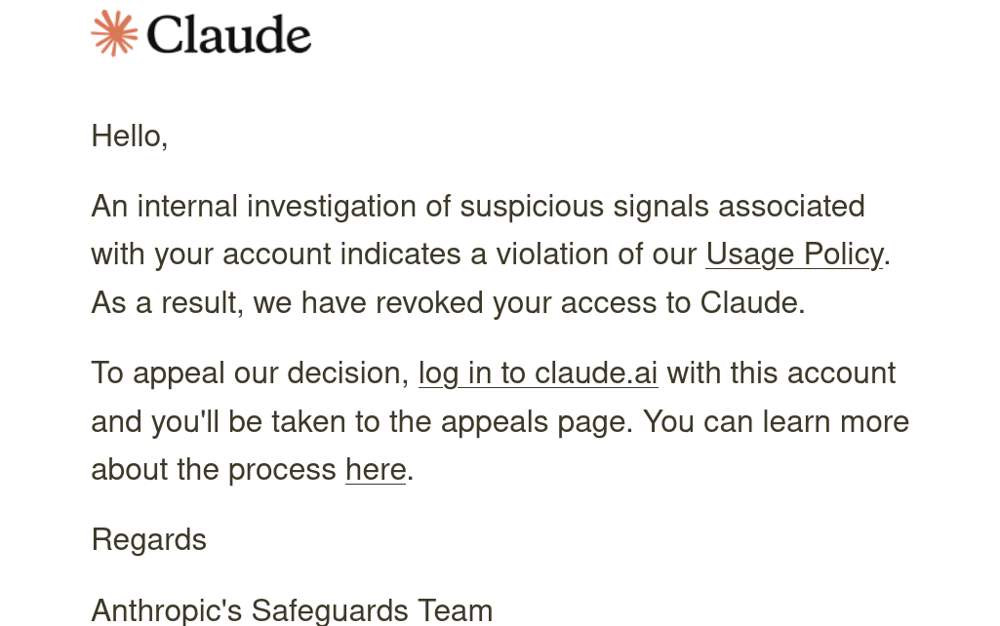
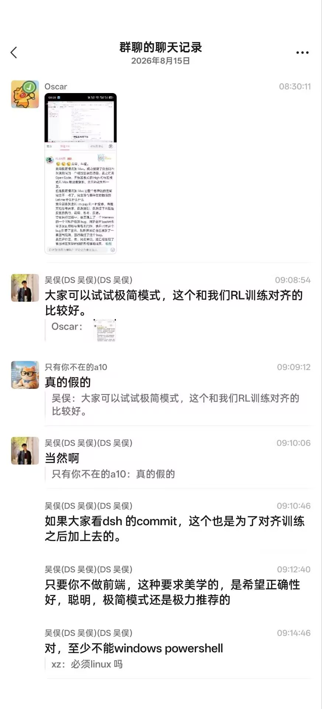
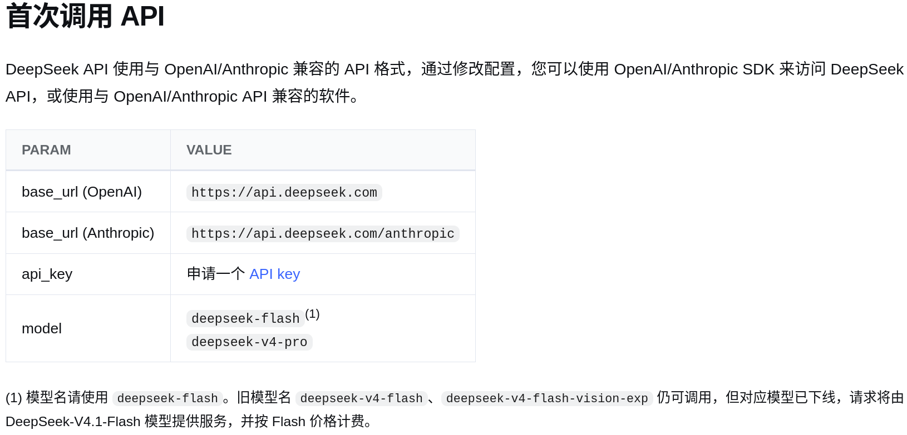
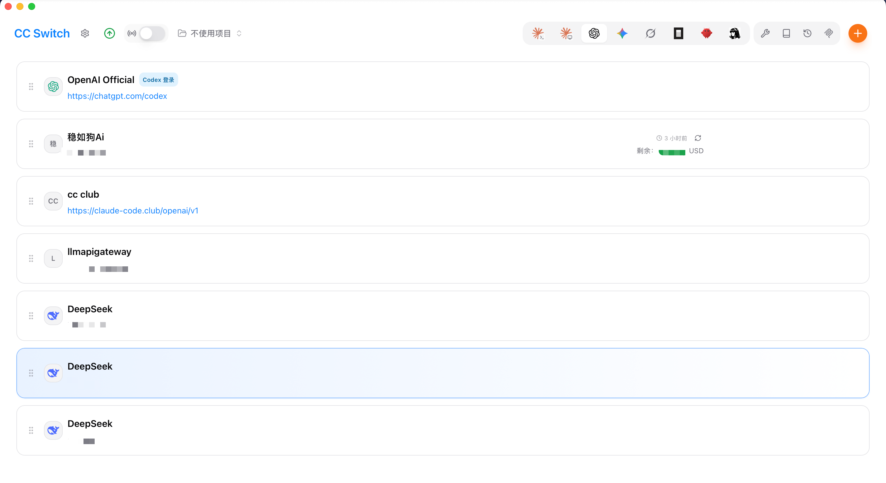
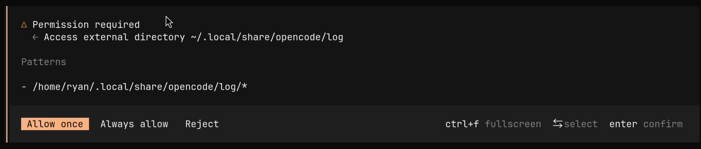
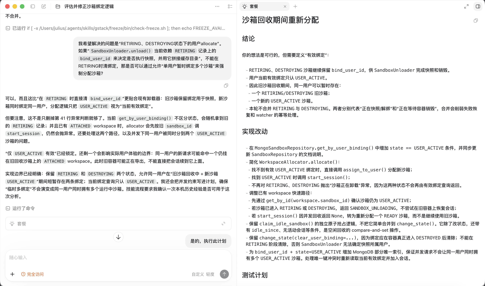

# Coding Agent 入门

Agent 是 LLM 及运行时框架（Harness）的结合体。

出于实际需要，人们为不同的工作设计了专门的 Agent，其中专为编码任务设计的叫作 Coding Agent。

由于 Coding Agent 是一个快速发展的概念，这篇文章不可避免地会有不少错漏。我们在这里暂时只介绍从 Harness、模型选择到 Agent 配置与使用的一些基本概念，至于具体使用需要大家查阅对应文档并动手尝试。

!!! question "为什么需要 Harness"

    不少同学或许使用过像是 ChatGPT、DeepSeek 或是豆包这样的 LLM 聊天机器人来完成编码工作。大家只需要在网页或客户端的聊天框中输入文字或上传图片来描述自己的需求，把这些内容作为提示词发送给机器人，稍等片刻就能看到回复中写好的代码。

    虽然通常这已经比大家手写快得多了，不过似乎还是存在一些问题：

    1. 需要手动从聊天窗口里把代码复制粘贴到自己本地的文件中，这有点麻烦。对于更大的包含多个文件和复杂结构的项目，这样手动复制几乎不太可能。
    2. 当对话过长时，聊天机器人可能会遗忘重要的内容。更糟糕的是大多数时候这种遗忘是隐式的：界面上并不会提示我们模型会在什么时候开始遗忘，遗忘哪些内容。

    Harness 的存在在一定程度上解决了这些问题：

    它给 LLM 提供了同外部世界交互的**工具**，允许它在一定边界内采取行动（比如让它可以自己调用工具去查看代码文件，或是执行某个命令并获得反馈，但是不应该允许它删掉你的重要文件）。

    它同时负责管理 LLM 的**上下文**，决定哪些内容该保留、哪些被丢弃和压缩，通过把某些重要的内容常驻在会话当中，Harness 也能缓解重要的信息随着上下文增长被隐式遗忘的风险。

    最后，为了让 LLM 能够使用工具并看到结果，根据上下文做出 「下一步该怎么做才能完成任务」 的决策，Harness 还需要**编排** LLM 的**控制循环**使其真的能够端到端地思考和解决问题。

    这里的三点可以说是 Harness 最重要的部分：**工具**（Tool）、**上下文**（Context）和**控制循环**（Control Loop，有时也被称为编排）。

## 选择模型和提供商

模型的选择需要综合考虑使用场景、模型能力、价格、稳定性和数据隐私等因素。

常见的性能指标包括：

- 模型能力
- 延迟 （Latency），在网络通畅的情况下主要取决于服务商的首 Token 时间（TTFT）
- 吞吐量 （Throughput），常用每秒 Token 数（TPS）来衡量

常见的价格影响因素包括：

- 模型输入输出定价
- 计费方式是按量付费还是订阅
- 缓存命中率和缓存价格

上述数据大多可以在 [Artificial Analysis](https://artificialanalysis.ai) 网站上查看。

除此之外，还有服务稳定性、数据留存规则等不同因素，大家有兴趣或有需要可以自行查阅。以下给大家介绍两种常见的方案。

### 按量计费

几乎所有模型厂商都提供这种方案。权重不开放的模型通常只能由厂商自己或其授权的服务商提供。开放权重模型的提供商往往数量较多。
如果想要比较某个模型按量计费方案下不同提供商的价格和性能，可以在 [Artificial Analysis](https://artificialanalysis.ai) 或 [OpenRouter](https://openrouter.ai/) 进入模型页面查看，其中后者还额外提供了数据留存的相关信息。

<figure markdown="span">
  
  <figcaption>DeepSeek V4.1 Flash 的部分提供商</figcaption>
</figure>

对于提供订阅服务的提供商来说，用量较大时，用户按量计费的总花费通常远高于订阅套餐；Agent 场景的 token 消耗普遍较高，按量计费可能带来高昂开销。

除了上述提供商，部分单位和个人也会搭建中转站来供客户按量计费使用海外前沿模型。由于许多中转站的上游使用批量创建的订阅账号池而非按量付费，它们的价格往往可以做到官方按量计费的 1/30 以下。但是大多数采用这种方案的中转站延迟和稳定性往往相对糟糕。

!!! warning "中转站的风险"

    除了合规风险外，部分中转站还存在模型掺水和数据隐私等风险。模型掺水指的是中转站商家以次充好，私自用低价模型代替高价模型的做法。另外，中转站商家可以读取和留存用户的会话记录并转售。更糟糕的是很多中转站的上游可能是其他中转站，这会使数据泄露的风险进一步放大。

!!! success "并行智算云 500 元代金券"

    在新疆昌吉州政府大力支持下，复旦大学联合北京并行科技股份有限公司推出 AI 教育教学算力支持计划，面向全校 “AI 大课” 师生（包含 AI-BEST 课程、 AI+ 师生共创项目等）发放 500 元代金券，可在 [此处](https://gecp.ai.paratera.com/portal/x8B4vL6yZ3) 使用 UIS 登录后领取并通过 「并行智算云」 调用大模型。
    
    截至 2026 年 9 月 27 日，这一平台已经可以提供 GLM 5.3 FlashX、DeepSeek V4.1 Flash、Kimi K3 等前沿开放权重模型。

### 购买订阅

不少大模型和云服务厂商提供订阅方案来让用户按月或按年订阅，并定期向用户发放使用配额。如果能充分利用这一配额，获得的使用量可能远超同等价格下的按量计费。

[GLM](https://bigmodel.cn/glm-coding)、[Kimi](https://www.kimi.com/membership/pricing)、[MiniMax](https://platform.minimax.cn/subscribe/token-plan) 都有官方的订阅方案供订阅者使用自家模型。除此以外，一些云服务厂商，比如 [火山引擎](https://www.volcengine.com/activity/codingplan) 和 [阿里云](https://www.aliyun.com/benefit/scene/tokenplan) 也提供包括 DeepSeek 在内多种模型的订阅计划。

<figure markdown="span">
  
  <figcaption>智谱提供的 GLM 订阅方案</figcaption>
</figure>

这一方案往往可以让大家用较低的价格使用前沿模型，同时 TTFT 更低，稳定性也不错。但大部分提供商的配额计算并不透明。

一些提供商，比如 [OpenCode](https://opencode.ai/go) 和 [Ollama Cloud](https://ollama.com/pricing) 提供相对透明的配额方案：它们提供了以美元计价的每月额度。取决于你所使用的模型，获得的配额一般在订阅价格的 1 到 6 倍之间。

受算力供给等因素影响，海外提供商的订阅套餐性价比往往更高，尤其是 OpenAI 和 Anthropic 的订阅套餐，在这些套餐中往往可以获得同等价格下比按量计费高出数十倍的前沿模型配额。但它们不向中国内地提供服务，也不接受中国内地的付款方式，并通过严格的风控策略来限制位于中国内地的用户使用其服务。

<figure markdown="span">
  
  <figcaption>TA 的 Claude 账号被 Anthropic 封禁</figcaption>
</figure>

## 选择 Harness

常见的由模型厂商开发的通用/编码 Harness 包括：

- OpenAI 公司推出的 Codex（CLI 开源）
- Anthropic 公司推出的 Claude Code（闭源）
- 月之暗面公司推出的 Kimi Code（开源）
- 智谱华章公司推出的 ZCode（开源）
- 深度求索公司推出的 DeepSeek Harness（开源）
- ...

常见的由第三方开发的 Harness 包括：

- Pi
- OpenCode
- ...

选择一个 Harness 的首要考虑是自己所要使用的 LLM。

为了更贴合 Agent 这一使用场景的需要，如今 LLM 的后训练大量围绕 Agent 能力展开。尽管厂家通常会在训练中组合使用多种 Harness 以提升模型在不同 Harness 上的泛化性，但实际上，模型不可避免地会在某些 Harness 上表现更好，而在另一些 Harness 上表现更差。

<figure markdown="span">
  { width="300" }
  <figcaption>在 DSH 极简模式上表现更好的 DeepSeek V4 Pro 0813</figcaption>
</figure>

由于许多厂商的商业策略是提供订阅套餐，将自家模型和 Harness 组合出售，厂商在训练时可能会优先保证模型在自家 Harness 上的表现。因此，模型厂商提供的第一方 Harness 通常会表现相对较好。除此以外，对开放权重模型来说，训练数据往往也覆盖了 Codex、Claude Code、OpenCode 等主流 Harness，因此模型在这些 Harness 上通常也有不错的表现。

Harness 自身的安全性也很重要。除了 Vibe Coding 本身可能带来的安全风险，部分厂商也在自家的 Harness 中收集使用数据并将其作为对用户进行风险控制的手段。考虑到部分海外厂商会主动封禁来自中国内地用户的访问，这可能会给大家的使用带来麻烦。

因为不同 Harness 的系统提示词和工具定义不同，前缀缓存的命中情况会有差异。具体差异需要大家在实际使用中体会和比较。

## 配置 Agent

现在我们已经选好了使用的模型和 Harness，接下来要做的就是将我们选好的模型配置进 Harness 了。大多数 Harness 都允许使用者配置来自不同提供商的模型，不过配置流程会根据大家选用模型的不同而存在一些差异。

如果大家使用的是模型厂商的官方 Harness 并已经购买了对应厂商的订阅套餐，那么配置会非常简单：只需在 Harness 里根据提示登录你购买订阅时使用的账号。

一般来说，除了这种情况以外，大家需要手动在自己的 Harness 中配置模型。这首先需要在提供商的网站上获取 Base URL 和 API Key 两个字段。其中 Base URL 是商家提供模型服务的网络路径，API Key 是商家鉴权和计费的依据，也是我们调用服务的凭证。获取这二者通常需要大家阅读模型提供商的文档。

以 DeepSeek 为例：

<figure markdown="span">
  
  <figcaption>DeepSeek 的文档</figcaption>
</figure>

常见的大模型调用接口包括 OpenAI Chat Completions、OpenAI Responses 和 Anthropic Messages。OpenAI 和 Anthropic 这两家厂商使用的调用接口成为了事实上的行业标准。

几乎所有 Harness 都支持这几种调用接口之一或全部：比如 Codex 支持 Responses API，Claude Code 支持 Messages API，OpenCode 三者都支持。

自己的 Harness 具体支持哪些接口，需要查阅对应的 Harness 文档。

除了 Base URL 和 API Key，提供商文档里通常还会给出模型 ID，比如图中的 `deepseek-flash` 和 `deepseek-v4-pro`。

!!! warning "不要泄露你的 API Key！"

    API Key 是提供商用来鉴权和计费的依据，任何获知你 API Key 的人都可以把调用记在你的账上！
    如果你需要在代码中用 API Key 请求外部模型，请通过同目录中的 `.env` 文件调用，避免在代码中硬编码 API Key。
    对于 Git 仓库，在创建 `.env` 文件前，请先把 `.env` 配置到 `.gitignore` 以在 Git Commit 时忽略此文件，从而确保不会把 API Key 传到远端（当然你可以在仓库中保留不含真实 API Key 的 `.env.example` 来指引他人填写 `.env`）。

下一步是将 Base URL 和 API Key 填写进自己的 Harness，这通常需要大家阅读 Harness 或模型提供商的文档。

比如 [DeepSeek 文档](https://api-docs.deepseek.com/zh-cn/) 中就提及了 Codex、Claude Code、OpenCode 等 Harness 的配置。

大家可能会发现使用像 DeepSeek 这样知名度较高的模型服务时不需要填写 Base URL，这是因为 Harness 的设计者为了用户体验把它们的 Base URL 内置到了程序当中。

同样是出于使用体验考虑，很多 Harness 还内置或是自动获取模型 ID，使用者只需要从它的列表里选择一个模型就可以了。但如果你的 Harness 没有这个功能，你需要参照文档填写所想要使用的模型 ID。

如果配置正确，通过输入框发送消息应当可以得到回复而不是报错。

如果报错，通常是 Base URL、API Key 或模型 ID 配置有误，也有可能是账户中余额不足，可以对照提供商文档逐项检查。

!!! tip 使用 CC Switch 交互式配置与切换 Harness 的模型供应商

    设想你有很多个 API Key：你既想在 Codex 中体验来自某中转站的 GPT 系列模型，又想体验 DeepSeek 模型，并且可能会来回切换。若按照各供应商的官方文档配置，你需要在终端多次修改环境变量，操作比较不优雅。
    CC Switch 是一个拥有交互界面的 Harness 模型供应商配置工具，可以维护多个 Harness 下的不同模型供应商 API Key 信息并快捷地配置和切换，并且能方便地选择兼容的大模型调用接口格式。其已支持下列 Harness： Claude Code、Codex、Gemini CLI、Grok Build、OpenCode、OpenClaw、Hermes、Pi。对单个 Harness 启用某供应商 API Key 时，它会帮你调整相应环境变量。

## 使用 Agent

### 工作区

在使用 Agent 进行编码时，我们通常会建立一个工作区并让 Agent 在其中工作。一个工作区通常包括项目的目录和完成项目需要参考的其他目录。一般来说，可以从项目的根目录开始建立工作区，再按需添加参考资料或其他相关项目的目录。

工作区也可以位于远程机器上。比如 OpenCode 支持在远程机器上运行服务端，再从本地通过终端或 Web 界面连接，此时项目文件的读写和命令执行都发生在远程机器上，具体可以参考它的 [远程连接文档](https://opencode.ai/docs/cli/#attach)。

工作区的一个作用是管理 Agent 的操作边界。在大多数 Harness 的默认权限设置下，Agent 修改或读取工作区外目录的内容往往需要经过用户的许可，这可以降低部分由于 Agent 幻觉导致的风险。

<figure markdown="span">
  
  <figcaption> OpenCode 的权限请求 </figcaption>
</figure>

很多 Harness 提供了自动批准 Agent 请求的功能，大家应当谨慎使用。

### 维护项目知识

在 Agent 能够读写项目文件之后，我们还需要考虑一件事：它应该怎样了解这个项目？

!!! question "它不能去读代码吗？"

    直接让 Agent 去读代码当然可行，并且在规模不那么大的代码仓库中是最高效的手段。但有些时候代码只能告诉 Agent 一个功能是如何实现的，而没法告诉它为什么要这样实现。比如，某段看似多余的代码可能是为了兼容旧版本的数据，某个测试只能在特定的机器上运行......这些项目特定的知识可能在之前的讨论中提到过，不过随着对话被压缩，或是换了会话、甚至另一种 Harness，它们未必还在 Agent 的上下文里。

在 Vibe Coding 的过程中大家有时会将将来仍然有用的知识保存在项目文件中，并随着项目的变化一起维护。

一个常见的做法是在项目根目录放置 [AGENTS.md](https://agents.md/)。这是一个写给 Agent 看的 Markdown 文件，可以记录构建和测试命令、修改代码时需要遵循的约定，以及其他项目文档的位置。支持这一约定的 Harness 会按自己的规则将文件内容加载到上下文中。

一些 Harness 也支持用户级的指令文件，用来保存跨项目通用的个人偏好。比如 OpenCode 支持在[用户配置目录中放置 `AGENTS.md`](https://opencode.ai/docs/rules/#global)。把这类知识保存在仓库中，是为了让它们随项目一起维护，并与其他参与者共享。

`AGENTS.md` 应当尽可能保持简短，只放大多数任务都需要知道的信息。而相对较长的信息可以放在 `README.md` 或 `docs/` 中，再在 `AGENTS.md` 里说明什么时候应该阅读或修改它们。

如果一类知识只在特定任务中才会用到，或者某套操作会反复执行，也可以把它们整理成下一节介绍的 [Skills](https://agentskills.io/home)，让 Agent 按需读取说明、查阅资料或执行配套脚本。

这些项目知识和代码同样需要维护。比较好的做法是让 Agent 在一次工作结束后更新过时的知识、补充缺少的说明，并在由你检查后将它们和代码一起提交。

### MCP 和 Skills

还记得我们一开始提到的 Harness 的三个核心部分吗？分别是工具、上下文和控制循环。大多数 Harness 的控制循环都遵循 ReAct（Reasoning + Acting，即「思考—行动」）范式，这一范式对普通用户来说一般没有修改的必要。为了让 Agent 完成不同的任务，人们会通过 MCP （模型上下文协议）和 Skills 从工具和上下文这两个方向扩大 Agent 的能力边界。

那它们是怎么工作的呢？

不知道大家有没有在 VS Code 中使用过 IntelliSense 这个功能：它的很多能力由语言服务器提供。语言服务器能够实时对代码进行静态分析。大家在编辑器里能快速跳转到定义或实现、改完一行马上看到错误提示而不用等待编译，靠的都是语言服务器。

时至今日，Agent 在相对较大的代码库中还是容易编造不存在的方法或接口——要是能让它像我们一样看到语言服务器的诊断信息就好了。

这需要我们对 Agent 做两件事情：

1. 给它一个工具：让它能够调用语言服务器做静态检查，并告诉它调用方法。
2. 给它一些知识：告知它对于我们的项目，在每次修改完代码后都要调用这个诊断工具进行静态检查。

像「要是 AI 能实时看到语言服务器的诊断信息就好了」这样的需求还有很多，并且其中不少因人而异：比如为某个特定异构计算硬件开发软件的程序员可能会想要让 Agent 在编写代码时了解硬件的物理限制；某个分析师可能会想要让 Agent 调用工具来获取几家新闻媒体的最新消息......

指望 Harness 开发者把为这些需求服务的工具和知识全部打包进去是不现实的，终端用户需要自己把这些工具和知识交给 Agent。

MCP 和 Skills 就是为解决这类问题而产生的。其中 MCP 为 Agent 提供了用户可以自定义的工具（比如一个从某个新闻网站获取消息的工具），Harness 可以据此将工具名、参数格式和说明放入 Agent 的上下文供其调用。Skills 允许 Agent 在进行某件任务的时候按需读取 Skill 中与任务相关的知识（比如为某类项目配置语言服务器、运行诊断和处理常见报错的方法）。

MCP 还可以用于从服务器获得资源，如果想要了解可以参看 [MCP 的文档](https://modelcontextprotocol.io)。

配置 MCP 和 Skills 时，我们还可以选择它们的作用范围。比如 OpenCode 可以将 MCP 写入[项目级或用户级配置](https://opencode.ai/docs/config/)，Skills 也有对应的[存放目录](https://opencode.ai/docs/skills/#place-files)：

- **项目级**：供当前项目使用，适合项目专用的工具和操作方法。
- **用户级**：供当前用户在同一 Harness 的多个项目中复用，适合经常使用的通用工具和知识，比如处理 PDF 或是制作 PPT 的 Skill。这样切换项目时就不必重新配置。

!!! example "金谷园饺子馆和麦当劳"

    金谷园饺子馆是一家北京邮电大学海淀校区旁边的饺子馆。这家饺子馆在 GitHub 上提供了自己的 Skill —— [金谷园饺子馆 Skill](https://github.com/JinGuYuan/jinguyuan-dumpling-skill) 和 [MCP 服务器](https://mcp.jinguyuan.cloud/) 来提供排队查询、在线取号等服务，通过 Skill 还可以回答「生饺子怎么煮」「你家店在哪儿」这类的问题。

    打开金谷园饺子馆 Skill 的 [项目仓库](https://github.com/JinGuYuan/jinguyuan-dumpling-skill)，看看这个 Skill 仓库的结构。

    Skill 通常是一个目录，入口文件名叫作 `SKILL.md`。目录中存放着记录领域特定知识的 Markdown 文件、资源或脚本。当知识规模较大时，通常入口文件只放索引、具体内容则分文件存放。在金谷园饺子馆的 Skill 中记载了通过它的脚本获取相关内容的方法和回复用户的方式。

    虽然上海暂时没有金谷园饺子馆，但大家熟悉的餐饮巨头麦当劳也推出了 [MCP 服务器](https://github.com/M-China/mcd-mcp-server)。

    大家可以给自己的 Agent 发送：
    
    > 帮我在用户级配置中接入这个 MCP，让我在不同项目中都能使用：https://github.com/M-China/mcd-mcp-server
  
    来接入麦当劳 ~~并给自己点一份咸蛋黄鸡腿蛋月堡三件套。~~ 

在较大的项目中，一个比较经济的做法是要求 Agent 将可复用的复杂操作总结成 Skill。只适用于当前项目的内容可以留在项目里，能用于多个项目的方法则可以整理成用户级的 Skill，之后在其他项目中复用。

### 计划模式

编码时，我们总是祈祷 Agent 尽量不要偏离我们的想法，“先想好再行动”是一个很符合常识的思路。

很多 Harness 提供了“计划模式”选项：如果你开启了“计划模式”，此轮次中，模型将不能改动代码，而只能阅读现有程序。在（可能出现的）询问你不少问题并调用工具了解仓库代码与知识后，Agent 会生成一个 Markdown 格式的详细编码计划向你展示并让你确认。你可以选择让它按照计划执行，或是输入新的提示词以调整并重新生成计划。计划模式最大的优势在于可以提前确认架构和部分细节，让程序员对即将出现的代码有初步的认识和控制。

需要注意的是，计划是用自然语言描述的，Agent 并不能保证计划覆盖到生成代码的每一处细节，更不能保证按计划生成的代码是清晰的高质量代码。（甚至对于稍弱的模型，不能百分百保证计划中的功能完全被实施！）因而我们有必要重新审查生成的代码。

~~注：某 TA 在某项目中见到一个满意的计划，但是后面灰溜溜地跑去重构了（悲~~

!!! Tip 小技巧

    通常来说，做计划时为了使 Agent 把握准确，需要使用更高的思考强度和更好的模型，实现具体代码时 Agent 不需要做计划时那么高的思考强度。

### 一些提示

#### 为自己的代码负责

即使使用 Agent 生成代码，维护代码还是每个程序员的职责。Git 会记录每行代码的贡献者（或者叫做担责者），因而对于关键的贡献，编程者应尽可能理解代码的基本逻辑，做到能掌控和解释。

#### 想好再做

不经思考放手让 Agent 生成的代码设计常常不能满足需要，难逃重构的命运，会令人心痛地浪费我们的 Token 和时间。更理想的工作方式是先确定你要实现的功能怎么拆分成各个模块的组合，再决定每个模块的关键逻辑，把设计给 Agent 形成计划后写出代码，最后做微小的审查和修改。

#### 重构看不懂的代码

Agent 通常写不出清楚简单的代码，生成的代码常有混杂散布的逻辑和不必要的异常处理。当你觉得理解代码片段比较费力时，通常意味着需要重构。你可以先让 Agent 解释其逻辑，经过自己梳理后提示 Agent 重构。令人庆幸的是，Agent 按照给定的逻辑简化重构原有代码的时间与费用成本不高。

#### 及时调整方向

Agent 运行时，我们可以即时查看其工具调用、输出的思考以及代码修改等情况。当我们发现情况不对劲时，例如 Agent 开始随意大改之前的代码结构，或者在工具调用中卡死，我们可以即时停止其当前轮次。后续我们可以提供更细化要求的提示词，诸如不要修改某一部分、先验证原流程、用户在运行时修改了其他代码等等。此外，Codex 允许用户在 Agent 运行时附加任意消息，且不中断 Agent 的运行。
